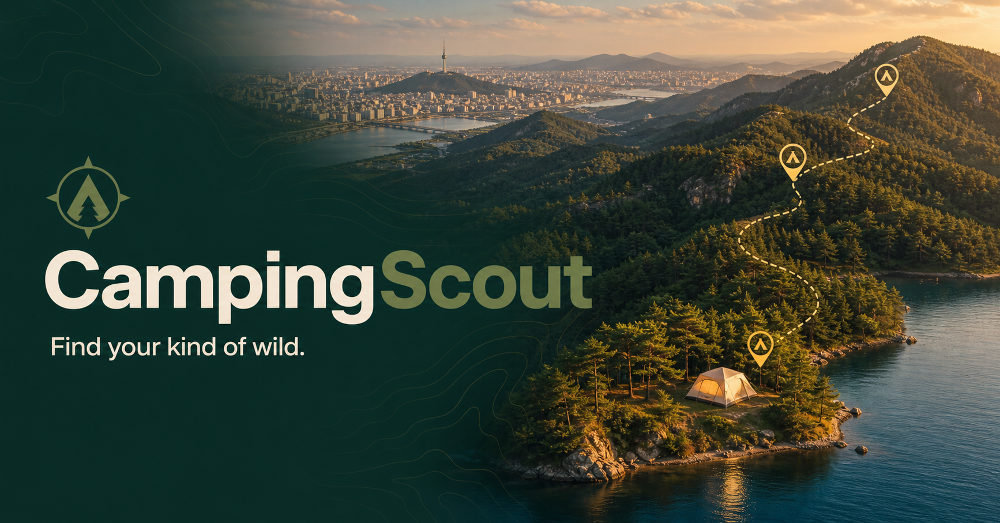

# CampingScout

> Find your kind of wild.

CampingScout is an evidence-aware AI camping planner built for OpenAI Build Week. It turns a departure point, dates, party, budget, gear, and “wild vs. convenient / quiet vs. popular” preferences into ranked campground choices, route-aware trip plans, and explicit equipment warnings.



## Why it matters

Camping search is fragmented across campground directories, weather pages, maps, operator sites, and gear checklists. CampingScout combines those inputs but keeps their provenance visible: public-data facts, live forecasts, routing results, and AI recommendations are labeled separately. It never presents AI inference as live availability or official safety advice.

## Product capabilities

- Live Korea Tourism Organization GoCamping plus OpenStreetMap Overpass geographic search (up to 80 factual candidates)
- Mapbox Directions and Isochrone routing, with live OSRM/OpenStreetMap road routing fallback
- Open-Meteo weather, automatic MET Norway fallback, and sleeping-bag comfort warnings
- One-click DeepSeek V4 Flash orchestration: profile interpretation → live candidate collection → road/weather enrichment → evidence-aware ranking → itinerary
- Temporary in-app OpenRouter key connection stored only in browser session storage
- Sign in with ChatGPT on OpenAI Sites
- Cloudflare D1 profile and saved-trip persistence
- Public, unguessable trip share links
- Real operator/booking links when the public record provides one
- Responsive desktop and mobile interface with keyboard focus states
- Source, live/fallback, and policy-verification labels throughout

## Architecture

```text
Browser (Next/Vinext UI + MapLibre)
  ├─ /api/campgrounds  → KTO GoCamping plus OpenStreetMap Overpass (Photon fallback)
  ├─ /api/search       → DeepSeek intent → Overpass/GoCamping → OSRM matrix → weather → DeepSeek rank + plan
  ├─ /api/navigation   → Mapbox Directions/Isochrone or OSRM route
  ├─ /api/weather      → Open-Meteo or MET Norway
  ├─ /api/plan         → OpenRouter (DeepSeek V4 Flash)
  ├─ /api/openrouter/test → real provider connection test
  ├─ /api/profile      → Sign in with ChatGPT + D1
  └─ /api/trips        → Sign in with ChatGPT + D1 + share route
```

The app runs on Cloudflare Workers through Vinext and OpenAI Sites. Secrets stay server-side; no private API key is shipped to the browser.

## Environment variables

Copy `.env.example` to `.env.local` for local development, or set these in the deployment environment:

| Variable | Required for live mode | Purpose |
| --- | --- | --- |
| `OPENROUTER_API_KEY` | Optional | Server-wide OpenRouter key; users may instead connect a temporary key in the UI |
| `OPENROUTER_MODEL` | No | Defaults to `deepseek/deepseek-v4-flash` |
| `GOCAMPING_SERVICE_KEY` | No | Enables richer data.go.kr GoCamping records; OSM remains live without it |
| `MAPBOX_ACCESS_TOKEN` | No | Enables isochrones; OSRM provides a live road route without it |
| `NEXT_PUBLIC_MAP_STYLE_URL` | No | Optional MapLibre-compatible map style |
| `NEXT_PUBLIC_SITE_URL` | Production | Canonical URL and shared-page server fetches |

`OPENROUTER_API_KEY`, `GOCAMPING_SERVICE_KEY`, and `MAPBOX_ACCESS_TOKEN` must be stored as deployment secrets. Never prefix them with `NEXT_PUBLIC_`. A key entered in the app is sent only to the same-origin server route and retained only in that tab's `sessionStorage` after a successful live test.

## Local development

```bash
npm install
npm run dev
```

Quality gates:

```bash
npm run typecheck
npm run lint
npm run build
npm audit --omit=dev
```

## Live vs. fallback behavior

The repository works without mapping or public-data private keys for judgeability. OpenStreetMap-based search and routing are live fallbacks, while every unavailable value remains explicitly labeled. OpenRouter still requires a server secret or a temporary in-app key.

- AI fallback never claims to be a live DeepSeek response.
- GoCamping falls back to live OpenStreetMap/Photon records, not invented campground facts.
- Routing falls back to live OSRM road geometry; no isochrone is invented.
- Weather automatically retries with MET Norway, then shows unavailable instead of inventing values.
- Saving requires an authenticated user and never silently creates an anonymous cloud record.

## Security and responsible use

- Provider keys are read only inside server routes.
- Database records are scoped to the authenticated email header supplied by the hosting platform.
- Share tokens are random 80-bit URL tokens and reveal only the selected trip payload.
- Inputs are type/range checked before provider calls; external links use `rel="noreferrer"`.
- DeepSeek receives supplied trip facts and is instructed not to invent policies, availability, weather, prices, routes, or safety claims.
- Users are repeatedly asked to verify operator policies, official alerts, and availability.

This is a planning assistant, not an emergency, weather-warning, or reservation service.

## Hackathon demo flow

1. Edit departure city, dates, travelers, budget, and drive radius.
2. Press **Search with Scout AI**. Scout interprets the saved profile, collects live candidates, attaches actual road times and forecasts, ranks them, and redraws the map.
3. Move the “Tune your wild” point or ask: “Make it quieter, dog-friendly, and safe for my 8°C sleeping bag” to rerun the full live pipeline.
4. Select any ranked marker and inspect its actual route, source, weather, gear warning, and AI explanation.
5. Open the operator link, save the generated trip, and share the copied link.

## License

MIT — see [LICENSE](LICENSE).
